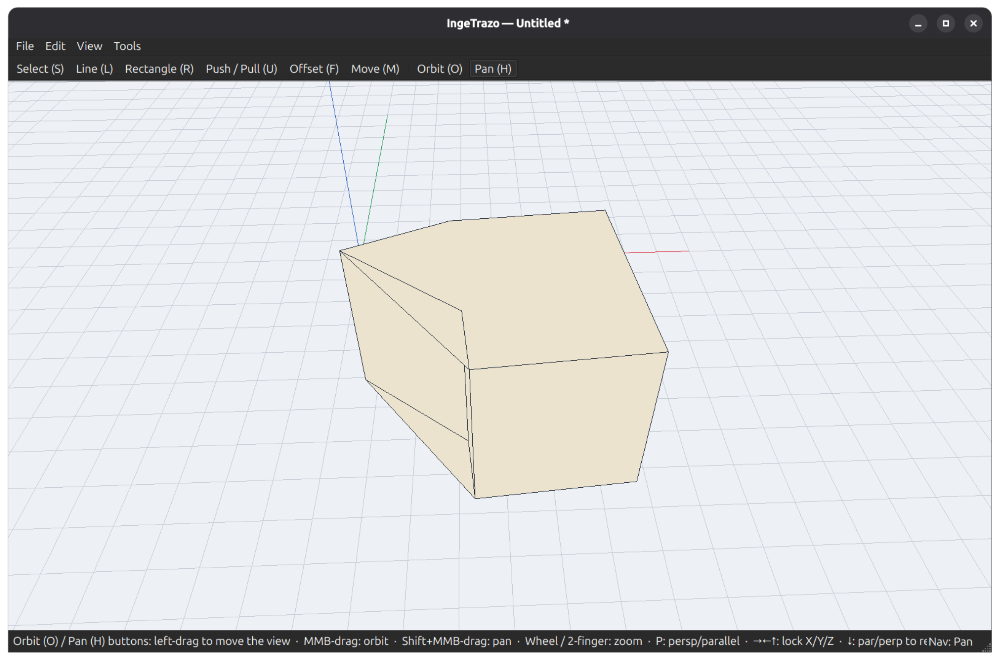

# IngeTrazo

**A free, SketchUp-inspired 3D modeler for architecture, civil engineering, and 3D printing — built natively for Linux.**


IngeTrazo brings SketchUp-style *push/pull* modeling to Linux — where there is
almost no native CAD for civil engineers and architects. It is freeform at the
core (draw anything, like sketching by hand) with an **optional BIM tagging
layer** planned on top: mark geometry as `IfcWall` / `IfcSlab` / `IfcColumn`,
export to IFC, and close the loop **model → tag → quantity takeoff → budget**
with its sister project [IngePresupuestos](https://ingepresupuestos.com).



> *The name is the thesis: **trazar** — to trace, as you would by hand.*
> **Trazá. Metrá. Presupuestá.**

## Status

**Early development — not production-ready, but already models end to end:** you
can draw, extrude, edit, paint, dimension, and export a model today. Backed by
~570 automated tests. Not yet packaged as an installable release.

## What works today

- **SketchUp-style viewport** — Z-up orbit camera, grid, colored axes,
  perspective ↔ parallel, standard views, zoom-extents, hidden-line removal.
- **Drawing tools** — Line, Rectangle, Rotated Rectangle, Circle, Polygon,
  Arc (2-point) and 3-Point Arc, with inferencing, snapping, axis locks and a
  Value Control Box (type exact lengths/coordinates).
- **Push/Pull** — robust, watertight extrude / recess / step / through-hole,
  solid-aware, with a **BIM-grade hermeticity guard** (never commits a broken
  solid — the difference that makes the geometry valid for quantity takeoff).
- **Offset** — walls with real thickness from a face outline.
- **Move** — with snap, inference and exact measured input.
- **Groups** — isolate geometry, move / explode / edit as a unit.
- **Curved solids** — SketchUp-style soft edges: smooth cylinders, curved-surface
  selection, view-dependent profile/silhouette edges.
- **Materials** — solid color per face and **SketchUp-compatible textures**
  (planar projection with real-world tile size), applied with a Paint tool.
- **Dimensions** — static annotations with hidden-line occlusion and styles.
- **Side tray** — Materials, Dimension style, Entity info panels.
- **Files** — native `.igz` save/open, **import OBJ**, **export STL and OBJ**
  (STL for slicers; OBJ with per-material colors).
- **Undo/redo** — every edit is a single atomic step.

## Planned

Tape Measure + guides · Eraser · face culling · connected/solid selection
gestures · **BIM tagging + IFC export** (the IngePresupuestos bridge) ·
Layers/Tags UI · COLLADA `.dae` import · geo-referencing (DEM + orthophoto,
photogrammetry via [OpenDroneMap](https://opendronemap.org)) · 3MF / DXF.

## Why IngeTrazo

There is no good native 3D CAD for the Linux-using civil engineer — SketchUp
has no Linux build and FreeCAD's UX is painful. IngeTrazo is that missing tool:
Linux-first, in Spanish, free software, and designed around the real workflow
of *tracing over a georeferenced site and tagging what you draw for takeoff*.

## Stack

Deliberately minimal — heavy dependencies arrive only when a feature needs them.

| Layer | What we use |
|-------|-------------|
| UI | **PySide6 6.11** (Qt 6) — the only runtime dependency |
| 3D rendering | Qt's bundled OpenGL (`QOpenGLShaderProgram` / `QOpenGLBuffer` / VAO), GLSL 3.30 Core |
| 3D math | `QMatrix4x4` / `QVector3D` (QtGui) — **no NumPy** |
| Vertex packing | `array` (Python stdlib) |
| Snapping / inference | custom (`core/snap.py`) |
| Tests | pytest |

## Quick start (developers)

```bash
git clone https://github.com/tuxiasumari/ingetrazo.git
cd ingetrazo
python3 -m venv venv
source venv/bin/activate          # Linux / macOS
# .\venv\Scripts\activate         # Windows
pip install -r requirements.txt
python main.py
```

Developed on **Python 3.14** (3.11+ should work). Run the tests with
`python -m pytest -q`.

## Contributing

Contributors from anywhere are welcome. See [CONTRIBUTING.md](CONTRIBUTING.md)
and [CODE_OF_CONDUCT.md](CODE_OF_CONDUCT.md). All code, comments and commit
messages are in **English**; the UI is bilingual (Spanish / English).

## License

[GPL-3.0-or-later](LICENSE) — the same copyleft family as Blender, FreeCAD and
PrusaSlicer. You are free to use, study, modify and redistribute IngeTrazo,
provided derivative works stay under the same license.

## Author

**Marco Sumari Tellez** — Civil Engineer, Lima, Peru. See [AUTHORS](AUTHORS).

---

## En español

**IngeTrazo** es un modelador 3D libre estilo SketchUp para arquitectura,
ingeniería civil e impresión 3D, **hecho nativo para Linux** — donde casi no
hay CAD para nuestra carrera. Es freeform en el núcleo (trazás lo que quieras,
como dibujando a mano) con una capa **BIM opcional** planeada encima: taggeás la
geometría como `IfcWall` / `IfcSlab` / `IfcColumn`, exportás a IFC y cerrás el
loop **modelar → taggear → metrar → presupuestar** junto a
[IngePresupuestos](https://ingepresupuestos.com).

**Ya funciona de punta a punta:** dibujás (línea, rectángulo, círculo, arco,
polígono), extruís con push/pull hermético grado-BIM, hacés muros con espesor
(offset), movés, agrupás, pintás con colores y texturas, acotás, y exportás a
STL/OBJ. En desarrollo temprano, respaldado por ~570 tests. Software libre
GPL-3.0, hecho en Perú. Más en [docs/](docs/).

*Trazá. Metrá. Presupuestá.*
