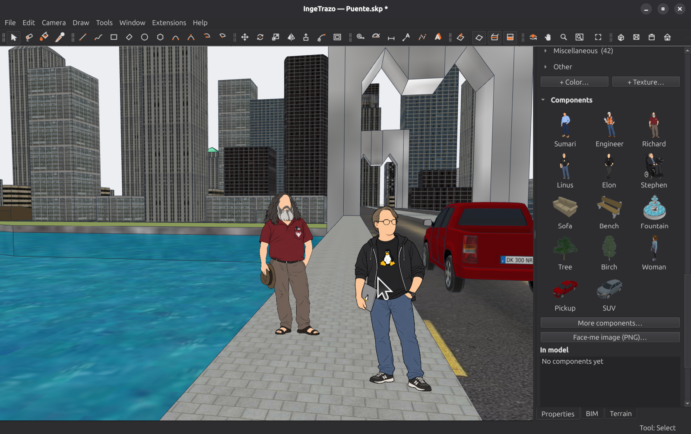

# IngeTrazo

**A free, SketchUp-inspired 3D modeler for architecture, civil engineering, and 3D printing — built natively for Linux.**


IngeTrazo brings SketchUp-style *push/pull* modeling to Linux — where there is
almost no native CAD for civil engineers and architects. It is freeform at the
core (draw anything, like sketching by hand) with an **optional BIM tagging
layer** planned on top: mark geometry as `IfcWall` / `IfcSlab` / `IfcColumn`,
export to IFC, and close the loop **model → tag → quantity takeoff → budget**
with its sister project [IngePresupuestos](https://ingepresupuestos.com).



> *The name is the thesis: **trazar** — to trace, as you would by hand.*

## Status

**Usable — real work gets done in it today.** Draw, extrude, edit, paint,
dimension and annotate; open any SketchUp file from 2013 to 2026 and save
back to `.skp`; tag BIM classes and export IFC quantities; georeference and
import survey data. IngeTrazo is developed by dogfooding on real engineering
projects, backed by ~2,000 automated tests, and its geometry engine refuses
to commit a broken solid (the hermeticity guard) — your quantities stay
honest. It is still a 0.x: the file format and plugin API may evolve between
minor versions, and rough edges exist — please
[report them](https://github.com/ingelibre/ingetrazo/issues).

## Install

Grab the [latest release](https://github.com/ingelibre/ingetrazo/releases/latest):

- **Windows**: the `-setup-` installer (or the portable `.zip`).
- **Linux (x86_64)**: the **Flatpak** — double-click `IngeTrazo.flatpak` and
  GNOME Software / KDE Discover installs it (`.igz`/`.skp` associated) — or
  the **AppImage** (make it executable and run it) or, if your distro lacks
  FUSE, the **tarball**:

```bash
chmod +x IngeTrazo-*-x86_64.AppImage && ./IngeTrazo-*-x86_64.AppImage
# or
tar -xzf IngeTrazo-*-linux-x86_64.tar.gz && IngeTrazo-*/ingetrazo
```

Python, Qt and the pure-Python `.skp` reader travel inside; nothing else to
install. `--check` prints what the install found and exits non-zero if
anything is missing.

## What works today

- **SketchUp-style viewport** — Z-up orbit camera, grid, colored axes,
  perspective ↔ parallel, standard views, zoom-extents, hidden-line removal.
- **Drawing tools** — Line, Rectangle, Rotated Rectangle, Circle, Polygon,
  Arc (2-point) and 3-Point Arc, with inferencing, snapping, axis locks and a
  Value Control Box (type exact lengths/coordinates).
- **Push/Pull** — robust, watertight extrude / recess / step / through-hole,
  solid-aware, with a **BIM-grade hermeticity guard** (never commits a broken
  solid — the difference that makes the geometry valid for quantity takeoff).
- **Offset** — walls with real thickness from a face outline.
- **Move** — with snap, inference and exact measured input.
- **Groups & components** — isolate geometry, move / explode / edit as a
  unit, and **copy/paste** with a solid, textured preview under the cursor;
  pasted component copies share their definition.
- **Rotate & Protractor** — SketchUp's protractor: plane inference with
  axis-coloured disc, 15° tick snapping near it, slope input as rise:run
  (`3:12`), rotate-a-copy (Ctrl), fold-axis by dragging, and angled guide
  lines that feed the snap engine.
- **Display styles** — Default, Architectural (textures on white), Shaded,
  Hidden line, Monochrome, Wireframe and X-ray; scenes remember their
  style and the sheet composer renders each viewport in any of them.
- **Curved solids** — SketchUp-style soft edges: smooth cylinders, curved-surface
  selection, view-dependent profile/silhouette edges.
- **Materials** — solid color per face and **SketchUp-compatible textures**
  (planar projection with real-world tile size), applied with a Paint tool —
  with a **named material registry**: paint keeps identity, edit-and-restamp
  updates every use, Model Info reports quantities per material, and exports
  carry the real names.
- **Dimensions & leader texts** — static annotations with hidden-line
  occlusion and styles; texts select by their glyphs, move with the anchor
  pinned, and edit on double-click. Both survive the `.skp` round trip.
- **Side tray** — Materials, Dimension style, Entity info panels.
- **SketchUp import AND export** — open `.skp` files natively (double-click
  too), every era from classic 2013–2020 to current 2021+, with materials,
  textures, per-side face materials, translucency, layers, scenes,
  dimensions and leader texts — and **save your model back as `.skp`**
  (groups, shared components, holes, named materials, dimensions and leader
  texts included). Pure Python, offline, no Wine or proprietary DLL —
  powered by [OpenSKP](https://github.com/iamahsanmehmood/openskp)
  (see [Acknowledgements](#acknowledgements)).
- **Files** — native `.igz` save/open (self-contained: textures travel inside
  the document), **import OBJ and COLLADA `.dae`**, **export STL, OBJ,
  COLLADA and glTF/GLB** (STL for slicers; glTF with PBR materials and
  geolocation).
- **Layers & Scenes** — visibility/lock tags (plans emerge from one model)
  and saved views (camera + per-layer visibility), both imported from `.skp`.
- **BIM tagging + IFC export** — tag freeform geometry with IFC classes
  (walls, slabs, columns, ...); tagged objects export to `.ifc` with honest
  quantities (areas always; volumes only when the object is watertight) —
  the bridge to [IngePresupuestos](https://ingepresupuestos.com) quantity
  takeoff.
- **Geo-referencing** — UTM datum, web basemap tiles, 3D terrain (DEM),
  traced geo-paths with a live longitudinal profile, survey-point CSV import
  (total station / GPS), and photogrammetric mesh import (WebODM / ODM).
- **Sheet composer** — scaled viewports of the model on paper sheets (each
  in any display style), vector hidden-line rendering, model-anchored
  dimensions, title block, PDF export.
- **Extensions** — a plugin system: drop a Python file in the plugins folder
  and its tools appear in the **Extensions** menu. Two reference plugins
  ship with the app: **Model Info** (model statistics) and a **Python
  Console** (live scripting over the open document, undo-integrated). A
  broken plugin can never prevent IngeTrazo from starting. See
  [docs/plugins.md](docs/plugins.md).
- **Undo/redo** — every edit is a single atomic step (console scripts
  included).

## Planned

Contour lines from terrain · professional 2D sheet output
(LayOut-equivalent) · DWG/DXF (with [IngeCAD](https://ingecad.org)) ·
IFC import · extension manager UI · Flathub packaging.

## Why IngeTrazo

There is no good native 3D CAD for the Linux-using civil engineer — SketchUp
has no Linux build and FreeCAD's UX is painful. IngeTrazo is that missing tool:
Linux-first, in Spanish, free software, and designed around the real workflow
of *tracing over a georeferenced site and tagging what you draw for takeoff*.

## Stack

Deliberately minimal — heavy dependencies arrive only when a feature needs them.

| Layer | What we use |
|-------|-------------|
| UI | **PySide6 6.11** (Qt 6) — the only runtime dependency |
| 3D rendering | Qt's bundled OpenGL (`QOpenGLShaderProgram` / `QOpenGLBuffer` / VAO), GLSL 3.30 Core |
| 3D math | `QMatrix4x4` / `QVector3D` (QtGui) — **no NumPy** |
| Vertex packing | `array` (Python stdlib) |
| Snapping / inference | custom (`core/snap.py`) |
| Tests | pytest |

## Quick start (developers)

```bash
git clone https://github.com/ingelibre/ingetrazo.git
cd ingetrazo
python3 -m venv venv
source venv/bin/activate          # Linux / macOS
# .\venv\Scripts\activate         # Windows
pip install -r requirements.txt
python main.py
```

Developed on **Python 3.14** (3.11+ should work). Run the tests with
`python -m pytest -q`.

## Contributing

Contributors from anywhere are welcome. See [CONTRIBUTING.md](CONTRIBUTING.md)
and [CODE_OF_CONDUCT.md](CODE_OF_CONDUCT.md). All code, comments and commit
messages are in **English**; the UI is bilingual (Spanish / English).

## Acknowledgements

- **[OpenSKP](https://github.com/iamahsanmehmood/openskp)** (MIT) by Ahsan
  Mehmood — the clean-room, pure-Python SketchUp `.skp` reader that powers
  IngeTrazo's native import. It replaced our Wine/DLL converter path entirely.
  IngeTrazo contributes back upstream: material and texture fidelity, per-face
  UV mapping, image entities, style colors, back-side materials, edge display
  flags, and a full reader for the classic pre-2021 MFC container format. If
  you need to read `.skp` files from Python, use OpenSKP — and give it a star.

## License

[GPL-3.0-or-later](LICENSE) — the same copyleft family as Blender, FreeCAD and
PrusaSlicer. You are free to use, study, modify and redistribute IngeTrazo,
provided derivative works stay under the same license.

## Author

**Marco Sumari Tellez** — Civil Engineer, Lima, Peru. See [AUTHORS](AUTHORS).

---

## En español

**IngeTrazo** es un modelador 3D libre estilo SketchUp para arquitectura,
ingeniería civil e impresión 3D, **hecho nativo para Linux** — donde casi no
hay CAD para nuestra carrera. Es freeform en el núcleo (trazás lo que quieras,
como dibujando a mano) con una capa **BIM opcional** planeada encima: taggeás la
geometría como `IfcWall` / `IfcSlab` / `IfcColumn`, exportás a IFC y cerrás el
loop **modelar → taggear → metrar → presupuestar** junto a
[IngePresupuestos](https://ingepresupuestos.com).

**Ya funciona de punta a punta:** dibujás (línea, rectángulo, círculo, arco,
polígono), extruís con push/pull hermético grado-BIM, hacés muros con espesor
(offset), movés, agrupás, pintás con colores y texturas, acotás, y exportás a
STL/OBJ. **Abre archivos `.skp` de SketchUp de forma nativa** (con doble clic),
de cualquier época (clásico 2013–2020 y actual 2021+), gracias a
[OpenSKP](https://github.com/iamahsanmehmood/openskp) — sin Wine ni DLLs. En
desarrollo temprano, respaldado por ~870 tests. Software libre GPL-3.0, hecho
en Perú. Más en [docs/](docs/).
